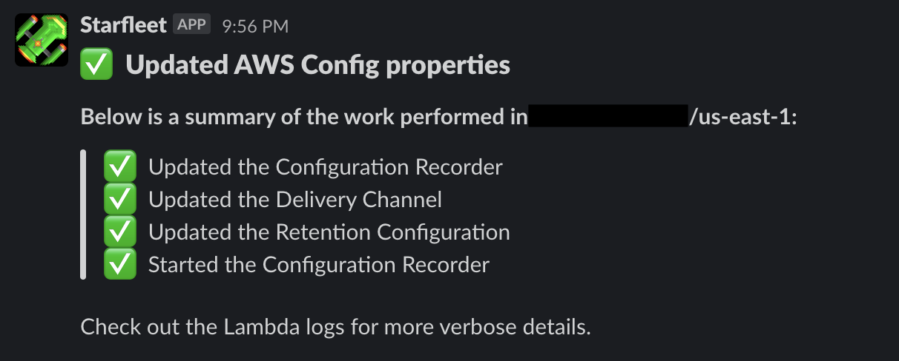

# Notifications & Alerts

Starfleet provides a mechanism (via Slack) to emit alerts and notifications. For configuring Slack itself, please reference the [User Guide](../../userGuide/Slack.md) section on that. There are a few components that make this work.

## Slack Singleton
Like most other major features of Starfleet, we have a singleton that will do most of the work for you for setting up a Slack client. The `SLACK_CLIENT` object in `starfleet.utils.slack` interacts with Slack (requires the [Secrets Manager component](SecretsManager.md) for accessing the `SLACK_TOKEN`).

!!! tip "Don't use the singleton directly"
    Do not use the singleton to interact with Slack. Interacting with Slack for alerts has a different mechanism that is abstracted by the `StarfleetWorkerShip` class. However, this section defines how this singleton works. The next section `Posting Alerts` will have the details on how you should be interacting with Slack.

Starfleet abstracts (perhaps over abstracts?) the messages that are sent to Slack by sending messages in the following categories:

1. Information Messages - ℹ️ - `post_info()`
1. Success Messages - ✅ - `post_success()`
1. Important Messages - 📣 - `post_important()`
1. Problem Messages - 🚨 - `post_problem()`

The code for all of them are effectively the same. How this works is that we will send a markdown formatted message (notice the emojis above) with a title that is prefixed with the emojis above. The singleton's functions (also above) receives the Slack channel ID, the title as a string, and the markdown formatted message to send over. The Slack application token needs to be configured to post messages to the channel ID in question.

## Posting Alerts
As mentioned, don't use the singleton to interact with Slack. The way that you should be interacting with Slack is by the mechanism built-in to the Starfleet worker ship class (`StarfleetWorkerShip`). The worker class has a method called `send_alert`, which takes in a `message_priority`, `title`, and the markdown of the body in `body_markdown`. The code for this is in `starfleet.worker_ship.ship_schematics` within the `StarfleetWorkerShip` class.

Alerts are only sent out if the user sets up the configuration for the worker to emit the message of a desired priority to a selected Slack channel.

### Message Priority
Starfleet's alerting logic is somewhat similar to the Python logging structure, that is to say, that it fits into a hierarchy. The values are defined in the `AlertPriority` `Enum` in `starfleet.worker_ships.ship_schematics`.

Here are the values of that enum and the meaning:

```python
NONE            # Do not alert anything
PROBLEM         # Only alert on errors or other items of significance to note (typically used for "bad" things)
IMPORTANT       # For information that is important but not necessarily an error
SUCCESS         # For information that would highlight that something was successful
INFORMATIONAL   # For purely informational messages
```

The priority is based on the order in the list above. The deeper in the list, the more verbose. This means that if a message alert is coded for `IMPORTANT`, the worker is configured for `PROBLEM`, then the alert will not be sent out. Conversely, if the message is coded for `IMPORTANT`, but the worker is configured for `INFORMATIONAL`, then the alert will be sent out. By default, a worker is configured for `NONE`, so no messages are sent out.

### Configuration
All workers have a configuration entry that allows you to configure Slack alerts that must be present for alerts to be set. This needs to be set for each worker. Each worker has a unique configuration entry for this so that we can have alerts in multiple channels with different priorities set.

Each worker Configuration has an optional field called `AlertConfiguration` that needs to outline the `ChannelId` and the `AlertPriority`. Below is copyied and pasted this section from the [Configuration](../../architecture/Configuration.md#worker-ship-configurations) section.

* **`AlertConfiguration`** - This is an encompassing dictionary that specifies a Slack channel ID and a message priority for sending alerts to Slack from that worker. This is documented more in the Developer and User guides around Notifications.
    * **`ChannelId`** - This is the Slack Channel ID that messages should be sent to
    * **`AlertPriority`** - This is the `AlertPriority` enum string. Acceptable values are: `NONE`, `PROBLEM`, `IMPORTANT`, `SUCCESS`, and `INFORMATIONAL`.

If you omit this section, then no Slack alerts will be emitted.

##### Configuration Example:

```yaml
GitHubSyncWorkerShip:
  Enabled: True
  TemplatePrefix: GitHubSyncWorkerShip/
  InvocationQueueUrl: https://sqs.us-east-2.amazonaws.com/SOMEACCOUNTID/starfleet-github-sync-worker
  InvocationSources:
    - EVENTBRIDGE_TIMED_EVENT
    - S3
  EventBridgeTimedFrequency: FIVE_MIN
  AlertConfiguration:  # <--- Send messages to Slack
    ChannelId: C.......
    AlertPriority: INFORMATIONAL
```

### Examples
Here is an example of this in use:

```python
try:
    worker.execute(commit=commit)
except Exception:
    message_text = (
        f"*Error processing AWS Config template: {worker.payload['template_name']}*\n"
        + f"*Unable to update the AWS Config configuration in: {worker.payload['starbase_assigned_account']}/{worker.payload['starbase_assigned_region']}.*\n\n"
        + f"The exception details are below:\n```\n{traceback.format_exc()}```"
    )
    worker.send_alert(AlertPriority.PROBLEM, f"Problem updating AWS Config properties for template: {worker.payload['template_name']}", message_text)
    raise
```

In this example, we have the following code:

```python
worker.send_alert(AlertPriority.PROBLEM, f"Problem updating AWS Config properties for template: {worker.payload['template_name']}", message_text)
```

The worker object has the `send_alert()` function that is inherited from the base `StarfleetWorkerShip` class. In this example, we are sending an alert to Slack if there was an unhandled exception when executing the AWS Config worker. The `message_text` is a markdown formatted string. We also pass in the `AlertPriority.PROBLEM` priority. If the user configures the worker to receive a `PROBLEM` or above, then the message will be sent to Slack.

Here is an example of a Slack alert for a `SUCCESS` message made by the AWS Config worker:


And another example of an `IMPORTANT` message GitHubSync worker adding files to the template S3 bucket:

